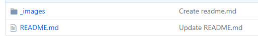

# Technical Writing

The purpose of this document is to give some tips and general guidelines for technical writing.

[Where to Start](#where-to-start)
[What to do](#what-to-do)
[What not to do](#what-not-to-do)
[Other Resources](#other-resources)

## Where to Start

[Back to Top](#technical-writing)

## What to do

### Know your Audience
Technical writing should be concise and easily understood by the target audience.  Usage of archaic words and unusual grammatical constructs will only cause confusion.

### Reduce the Clutter
Ensure that superfluous and irrelevant details are not included in the document.  This will often derail the audience and cause confusion and noise.

### Document As Code
Store documents in Git.  In doing so, you create an audit trail of changes as well as provide an easy way to share the documents.  

In Git, organize the documents such that it is easy to find.    Reduce the clutter by storing images in a subfolder called `_images`.


 
[Back to Top](#technical-writing)

### Use Examples
Use examples frequently to get across the idea of the concept being documented.  At times, it is helpful to even include small snippets of code, but be sure to include only the relevant lines to the topic.  The example here is how to include an image in a md document:

```

```
### Keep screenshots small
This point really does require repeating often for technical writing.  Don't include details that are superfluous and irrelevant because that causes confusion and noise.   This applies not only to verbiage in a document, but also to the screen shots.  Keep screenshots small and only include the necessary parts of the image.

## What not to do

### First Person / Second Person
Avoid referring to the first or second person.  
The following is a list to avoid

| person  | avoid these words
|:-----|:-----
|first| I, we, me, mine
|second| You, yours

### Slang
Do not use slang in documents.  Often slang will not cross international boundaries and be understood well globally.


[Back to Top](#technical-writing)


## Other Resources

Below are listed other resources that can be referenced for tips on great Technical writing
[Freelance Folder Ten Great Technical Writing Tips](http://freelancefolder.com/ten-great-technical-writing-tips/ )
